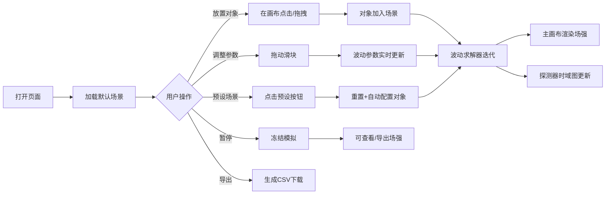

## 1. 产品概述

电磁波传播模拟器是一款基于Web的交互式物理教学与演示工具，通过数值求解波动方程，直观展示电磁波在各种环境下的传播、反射、折射、衍射、干涉等经典波动现象。目标用户包括物理学习者、教师、研究人员及对波动理论感兴趣的开发者。

本产品以直观的可视化方式揭示电磁波的本质行为，可作为课堂演示工具、自学辅助材料或研究快速原型工具。

## 2. 核心功能

### 2.1 用户角色

| 角色 | 注册方式 | 核心权限 |
|------|----------|----------|
| 普通用户 | 无需注册，浏览器直接访问 | 完整使用所有模拟、交互、导出功能 |

### 2.2 功能模块

1. **主模拟画布**：二维场强可视化、波前叠加、对象绘制与选择
2. **控制面板**：波类型选择、波参数调节、显示模式切换、预设场景
3. **对象工具栏**：放置波源（点/线状）、障碍物（矩形/圆形）、探测器
4. **探测器时域图**：独立画布绘制探测器处场强随时间变化曲线
5. **信息区**：暂停状态、鼠标坐标、瞬时场强读数
6. **数据导出**：将当前场强矩阵导出为灰度CSV

### 2.3 页面详情

| 页面名称 | 模块名称 | 功能描述 |
|---------|---------|----------|
| 主页面 | 主模拟画布 | 600×600像素主画布，实时渲染场强分布；支持点击查看场强、放置对象、选择删除对象 |
| 主页面 | 控制面板（左栏） | 波类型（平面波/球面波）、波长滑块、振幅滑块、相位滑块、显示模式（相位颜色/振幅亮度）、波前显示开关、暂停/继续按钮、重置按钮、导出CSV按钮 |
| 主页面 | 对象工具栏（顶部） | 放置点状波源、线状波源、矩形障碍物、圆形障碍物、探测器工具；删除选中对象 |
| 主页面 | 探测器时域图（右栏） | 250×200像素辅助画布，实时绘制选中探测器的E(t)曲线，带时间轴标签和峰值标注 |
| 主页面 | 预设场景栏（底部） | 快速加载：双缝干涉、方形障碍物衍射、半波带、自由传播、圆孔衍射 5种预设 |
| 主页面 | 状态栏 | 显示当前时间步数、是否暂停、鼠标位置坐标、瞬时场强数值 |

## 3. 核心流程

用户打开页面后默认加载自由传播场景。用户可以：
- 通过对象工具栏选择放置工具 → 在画布点击/拖拽放置 → 控制面板调节参数 → 观察波动行为
- 点击预设按钮 → 自动重置场景并放置配置好的对象 → 演示经典物理现象
- 在模拟运行中点击画布任意位置 → 状态栏显示该点(x,y)处的瞬时场强E
- 放置探测器 → 时域图自动开始记录 → 可观察拍频、驻波等时域特征
- 点击暂停 → 场强定格 → 可详细检查/导出当前分布为CSV

## 4. 用户界面设计

### 4.1 设计风格

- **主色调**：深邃夜空蓝 `#0a0e27` 为背景，搭配高饱和电蓝 `#00e5ff` 和琥珀黄 `#ffb347` 作为强调色；模拟区采用HSV相位色环渲染。
- **视觉风格**：赛博物理风（Cyber-Physical）——深色科技感基底，荧光发光描边，栅格背景微噪点，营造实验室示波器的沉浸感。
- **按钮样式**：方形切角按钮（`clip-path` 模拟切角），悬浮时边框发光，按下有内凹阴影。
- **字体**：标题采用 `Orbitron`（科技感等宽显示字体），正文采用 `JetBrains Mono`（等宽代码字体），数据读数使用 `Share Tech Mono`。
- **布局**：三栏式仪表盘布局——左控制栏 / 中主模拟区 / 右探测时域区；顶部工具栏、底部预设栏。
- **图标风格**：纯CSS绘制几何图标 + Unicode几何符号，不依赖外部图标库。

### 4.2 页面设计概览

| 页面名称 | 模块名称 | UI元素 |
|---------|---------|--------|
| 主页面 | 主模拟画布 | 600×600 Canvas，背景10px栅格+微噪点，鼠标悬停十字准星，点击场强数值tooltip，对象高亮描边选中效果 |
| 主页面 | 控制面板 | 卡片式分组（波源参数/显示设置/操作按钮），滑块采用自定义发光轨道，标签+数值并列显示 |
| 主页面 | 顶部工具栏 | 工具按钮组，当前选中工具边框发光并带小三角指示器，按钮含几何图标+文字双行 |
| 主页面 | 探测器时域图 | 浅绿刻度网格，场强曲线荧光青渐变+光晕，右侧Y轴标签，底部时间轴，实时峰值红点标注 |
| 主页面 | 预设场景栏 | 5个横向并排场景卡片，悬停上浮+边框发光，点击后高亮选中 |
| 主页面 | 状态栏 | 底栏半透明黑，分三格显示：时间步/暂停状态 | 坐标/场强 | 内存FPS |

### 4.3 响应性

- Desktop-first 设计，优先适配 1280×800 及以上桌面分辨率。
- 控制栏与时域图固定宽度（260px），主画布在 600-800px 区间自适应。
- 窗口宽度 < 1100px 时自动切换为上下布局：顶部控制栏 / 中部画布 / 底部时域图。
- 触摸设备：手指点击放置对象，双指缩放查看（可选，最低支持触控点击精度）。

### 4.4 渲染性能优化

- 主画布使用 `ImageData` 直接像素操作，避免逐像素 `fillRect`。
- 波动求解采用有限差分法（FDTD简化版），使用 `Float32Array` 存储场强历史。
- 波前可视化使用独立线条图层，不重绘整场强。
- 探测器时域图限制历史数据点为 500 个，循环覆盖。
