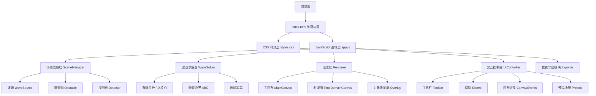

## 1. 架构设计



## 2. 技术描述

- **前端**：纯原生 HTML5 + CSS3 + Vanilla JavaScript（ES2020+），**零依赖、零构建、零网络请求**，双击 `index.html` 即可运行。
- **数值计算**：二维标量波动方程的有限差分时域（FDTD）简化方法，使用 `Float32Array` 存储三场量（u_curr / u_prev / u_next），网格分辨率 600×600，时间步长由 Courant 条件约束。
- **边界条件**：四周采用完全匹配层（PML简化版→吸收边界条件），防止边界反射干扰场内物理。
- **渲染**：HTML5 Canvas 2D Context，`putImageData` 每帧直接刷新像素；相位色采用 HSV→RGB 映射；振幅亮度采用灰度+伽马校正。
- **字体**：通过 Google Fonts CDN 引入 `Orbitron`、`JetBrains Mono`、`Share Tech Mono`，离线回退为 `monospace`。
- **文件布局**：
  ```
  1154/
  ├── index.html        # 单页应用入口，全部DOM结构
  ├── styles.css        # 所有样式（赛博物理风主题）
  └── app.js            # 所有JS逻辑：求解+渲染+交互
  ```

## 3. 模块划分（app.js 内部架构）

无显式路由（单页应用），按职责划分为如下逻辑模块（使用 IIFE + 对象字面量组织，避免全局污染）：

### 3.1 CONFIG
全局常量：网格尺寸 `GRID_W=600`、`GRID_H=600`、空间步 `dx=1`、Courant 数 `r=0.45`、吸收层厚度 `ABS_LAYERS=20`、探测器历史长度 `DETECTOR_HISTORY=500`。

### 3.2 STATE
运行时状态：
- `paused: boolean`
- `timeStep: number`
- `waveParams: {type, wavelength, amplitude, phase, speed}`
- `displayMode: 'phase' | 'amplitude'`
- `showWavefronts: boolean`
- `objects: {sources, obstacles, detectors}`
- `selectedTool: 'select' | 'pointSource' | 'lineSource' | 'rectObs' | 'circleObs' | 'detector'`
- `selectedObject: ref | null`
- `fields: {curr, prev, next} // Float32Array`
- `mouse: {x, y, hoverField}`
- `detectorData: Map<id, Float32Array>`

### 3.3 WaveSolver
- `step()`：执行一次 FDTD 迭代，对内部非障碍物点求解 `u_next[i,j] = 2u_curr - u_prev + r²(∇²u)`
- `applySources(t)`：根据参数向波源位置注入时域源信号（正弦波，考虑波长/振幅/初相）
- `applyAbsorbingBoundary()`：对四周 `ABS_LAYERS` 宽度网格应用衰减因子
- `applyObstacles()`：障碍物内场强强制置零（理想电导体近似）

### 3.4 Renderer
- `renderField()`：遍历像素，根据显示模式将场强值映射为颜色，写入 ImageData 并 putImageData
- `colorFromPhase(value)`：相位→HSV色相映射（v=0→红, λ/2→蓝, λ→红循环）
- `colorFromAmplitude(value)`：振幅绝对值→灰度亮度，带伽马校正
- `renderOverlay()`：叠加绘制波源图标、障碍物边框、探测器标记、选中对象高亮、波前等高线
- `renderWavefronts()`：绘制移动的波阵面线条（相位=0 mod 2π 等值线）
- `renderTimeDomain(detector)`：右栏时域图绘制E-t曲线、网格、坐标轴、峰值标注

### 3.5 UIController
- `initEventListeners()`：所有DOM事件绑定
- `onCanvasMouseDown/Move/Up()`：处理放置/拖拽/选择
- `onSliderInput()`：实时更新 STATE.waveParams 并更新数值显示
- `onToolSelect(tool)`：切换当前放置工具
- `onObjectClick(obj)`：选中对象，显示删除按钮
- `onPresetLoad(name)`：调用 PRESETS 配置，重置 STATE.objects 并更新

### 3.6 PRESETS
预设场景配置：
- `doubleSlit`：双缝干涉（平面波 + 双缝矩形障碍物对）
- `squareObstacle`：方形障碍物衍射（平面波 + 居中方形障碍物）
- `halfZonePlate`：半波带（多个同心环形障碍物组成的菲涅尔波带片）
- `freePropagation`：自由传播（点源球面波，无障碍物）
- `circularAperture`：圆孔衍射（平面波 + 带孔大障碍物）

### 3.7 Exporter
- `exportCSV()`：遍历当前 `u_curr`，归一化到 0-255 灰度值，按行生成逗号分隔字符串，构建 Blob 并通过 `<a download>` 触发下载。文件名格式 `field_{YYYYMMDD}_{HHmmss}.csv`。

## 4. 核心算法

### 4.1 二维标量波动方程 FDTD
方程：`∂²u/∂t² = c² (∂²u/∂x² + ∂²u/∂y²)`

离散化（中心差分，二阶精度）：
```
u_next[i,j] = 2*u_curr[i,j] - u_prev[i,j]
            + r² * (u_curr[i+1,j] + u_curr[i-1,j]
                   + u_curr[i,j+1] + u_curr[i,j-1]
                   - 4*u_curr[i,j])
```
其中 `r = c·dt/dx`，取 `r=0.45 < √0.5` 满足 Courant 稳定条件。

### 4.2 波源注入
- **点源**：单个格点 `(sx,sy)` 在时间 t 注入 `A·sin(ωt + φ₀)`
- **线源**：沿给定线段所有格点同时注入同相位信号（模拟平面波近似）
- **平面波模式**：从画布左边界（或上边界）整行注入正弦，实现真正平面波入射

### 4.3 吸收边界（近似 PML）
对四周 20 层网格，每步后乘以衰减因子 `α(x)`，α 从内到外由 0.995 渐变至 0.95，抑制边界反射。

### 4.4 障碍物
障碍物内格点每步强制 `u = 0`，模拟理想导体边界条件（E_tan=0），从而产生镜面反射。对障碍物边缘格点做一阶平均过渡。

### 4.5 波前可视化
对全场强取正弦相位 `sin(2πu/λ + φ)`，提取 `|sin(...)| > 0.95` 的像素点作为亮线，每帧以半透明白色叠加绘制。

## 5. 性能预算与兼容

- **目标帧率**：现代笔记本 CPU 上稳定 30-60 FPS（600×600 网格）
- **内存占用**：三场量 ≈ 600×600×4B×3 ≈ 4.3 MB；探测器数据总计 < 100 KB
- **浏览器兼容**：Chrome/Edge 90+、Firefox 88+、Safari 14+（需支持 ES2020、BigInt 可选、Canvas2D putImageData）
- **离线运行**：字体CDN失败时自动回退系统等宽字体，不影响核心功能
